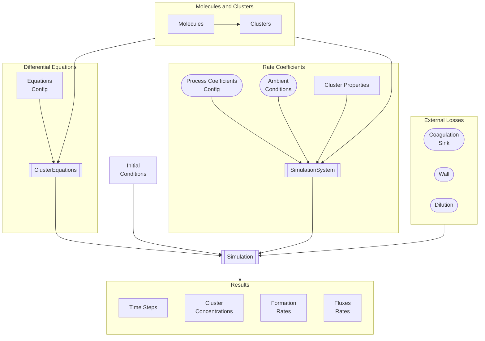

# eduACDC - Educational Atmospheric Cluster Dynamics Code

An educational Python implementation of the Atmospheric Cluster Dynamics Code (ACDC) for atmospheric outgrowth simulations.

## Installation

### Install from GitHub

```bash
pip install git+https://github.com/edahelsinki/eduACDC.git
```

For development (editable install):

```bash
git clone https://github.com/edahelsinki/eduACDC.git
cd eduACDC
pip install -e .
```

### Option A: Using a virtual environment (venv) + pip

```bash
python -m venv .venv
source .venv/bin/activate   # On Windows: .venv\Scripts\activate
pip install -e .
```

### Option B: Using uv

```bash
uv venv
source .venv/bin/activate
uv pip install -e .
```

Or run without activating (uv handles the env):

```bash
uv run python examples/run_simulation.py
```

## Usage

Run the example simulation:

```bash
python examples/run_simulation.py
```

See [examples/run_simulation.py](examples/run_simulation.py) for a minimal workflow: loading a YAML config, creating a `Simulation`, and running steady-state outgrowth. Explore the `examples/` directory for more YAML system configuration files.

## Code Layout



## Project Structure

- `eduacdc/` — Main package code
- `examples/` — YAML system configuration files (ADW, ANW, AN_neutral_neg_pos, three_component_system)

## Modules

| Subpackage | Purpose |
|------------|---------|
| **`eduacdc.core`** | Molecules, clusters, cluster properties, process coefficients, ODE equations, ambient conditions, coagulation loss, and wall loss models |
| **`eduacdc.analysis`** | Flux analysis, DeltaG/rate visualization, and concentration/size-distribution plotting |
| **`eduacdc.io`** | YAML parsing for system and equations configuration |
| **`eduacdc.simulation`** | ODE solver and results container |
| **`eduacdc.utils`** | Physical constants, Pint unit registry, and quantity parsing |

For detailed module documentation, see [eduacdc/README.md](eduacdc/README.md).
